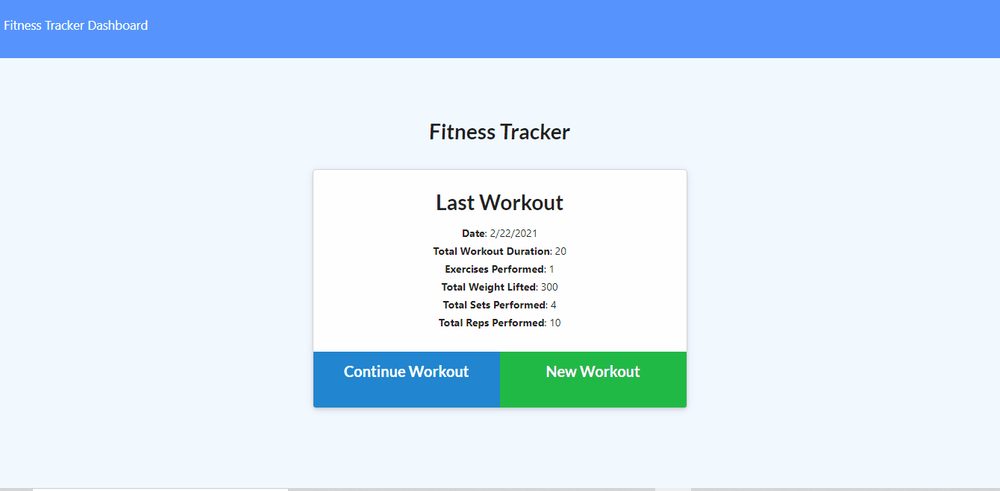

# Fitness Tracker

An app for logging workouts, by Seth Zygarlicke

### Links

* Github Repository: [https://github.com/ElderBass/Fitness-Tracker.git](https://github.com/ElderBass/Fitness-Tracker.git)
* Heroku Deployed: [https://serene-ocean-84827.herokuapp.com/](https://serene-ocean-84827.herokuapp.com/)

## Table of Contents


* [Description](#description)
    
* [Installation](#installation)

* [Technologies](#technologies)
    
* [Contributing](#contributing)
    
* [Questions](#questions)

## Description

Fitness Tracker is a node/express application for creating, customizing, logging, and tracking your workouts. 

The user opens the application and starts a new workout. From there, they are led to a form for filling out details on the nature of their exercise. First, they choose either a 'resistance' or 'cardio' exercise. Depending on what they choose, the form's fields will change accordingly. 

For 'resistance' exercises, they must enter the name of the workout, the weight at which they will perform the workout, the number of sets and reps they will do, and duration of the exercise. 

Similarly, for cardio, the user enters the name of the exercise, the number of miles they will travel, and the duration of the exercise.

On the final exercise the user plans on entering - and this is key - the user must hit the COMPLETE button. This will log the final exercise into the workout and return the user to the 'home' page. On the home page will now be displayed stats for the workout just logged. The user can now click 'Continue Workout' to add more exercises to the current workout, or they can create a fresh workout and add exercises to it.

The user can check statistics on all the past seven workouts logged by clicking on the 'Dashboard' link in the navigation bar. This navigates the user to page displaying two charts, one for total duration of the past seven workouts, the other showing total weight lifted per workout. Both of these data will have a color-coded pie chart beneath them for a different visual representation of their data.

### Demonstration




## Technologies

Fitness tracker is a node.js application that uses the express npm package to establish a connection to servers and develop routes between the client and server. Another critical dependency is the mongoose npm package, which allows the application to connect to the application's database stored in Mongo. 

One other package used in this application was nodemon, which allowed us to restart and render our application in real time after changes and saves.

All of the code was written in the VS Code program.  

## Installation

To install the many dependencies this application utilizes, open the server.js file a new integrated terminal in your VS Code and run the following command:

```
npm i
```

This will install every dependency contained within the package.json file.

## Contributing

If you wish to contribute to this repository, feel free to fork it to your local machine and do with it as you please.

## Questions 

If you have any questions or comments about this repo, email the creator Seth at [zygster11@gmail.com](zygster11@gmail.com)

For more projects by Seth, visit his Github page at [https://github.com/ElderBass](https://github.com/ElderBass)